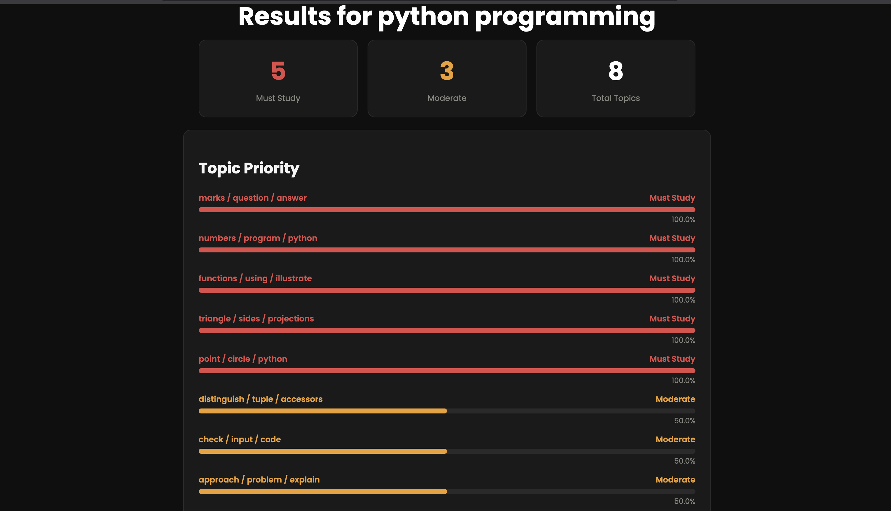

# 📄 Exam Paper Pattern Analyzer

A machine learning web app that analyzes past year question papers and tells 
you exactly what to study — and what to skip.

## 🔗 Live Demo
[exam-paper-analyzer.onrender.com](https://exam-paper-analyzer.onrender.com)

## 📸 Screenshot


## 💡 The Problem
Every engineering student wastes time studying topics that never appear in 
exams while missing ones that repeat every year. This tool replaces guesswork 
with actual data — let the papers tell you what to study.

## ✨ Features
- Upload multiple past year question papers as PDFs
- Automatically extracts individual questions using regex parsing
- Clusters questions into topics using TF-IDF + KMeans (no hardcoding)
- Auto-labels each topic using top keywords from the cluster
- Classifies topics as Must Study / Moderate / Low Priority based on frequency
- Predicts topics likely to appear based on gap detection logic
- Visual progress bars, summary cards, and loading screen

## 🛠️ Tech Stack
| Layer | Technology |
|---|---|
| Backend | Python, Flask |
| PDF Parsing | pdfplumber, regex |
| ML / NLP | scikit-learn (TF-IDF, KMeans) |
| Frontend | HTML, CSS, Vanilla JS |
| Deployment | Render.com |

## 🔬 How It Works
1. **PDF Parsing** — pdfplumber extracts raw text from each uploaded paper. 
   Regex patterns remove university headers, roll numbers, and noise.
2. **Question Extraction** — text is split into individual questions using 
   numbered pattern matching. Marks are detected from patterns like `(5)` or `[10]`.
3. **Topic Clustering** — TF-IDF converts questions into numerical vectors. 
   KMeans groups similar questions into N clusters. Each cluster is 
   auto-labeled using its top 3 TF-IDF keywords.
4. **Pattern Detection** — frequency of each topic across all uploaded years 
   is calculated. Topics appearing 70%+ of years → Must Study. Topics that 
   appeared regularly but not recently → flagged as predicted.

## 🚀 Run Locally
```bash
# Clone the repo
git clone https://github.com/AARANYA-SINGH12/exam-paper-analyzer.git
cd exam-paper-analyzer

# Create virtual environment
python3 -m venv venv
source venv/bin/activate

# Install dependencies
pip install -r requirements.txt
python -m spacy download en_core_web_sm

# Run the app
python3 app.py
```
Open `http://127.0.0.1:5000` in your browser.

## 📁 Project Structure

```
exam-analyzer/
├── analyzer/
│   ├── pdf_parser.py          # PDF text extraction + cleaning
│   ├── question_extractor.py  # Question splitting + marks detection
│   ├── topic_clusterer.py     # TF-IDF + KMeans + keyword labels
│   └── pattern_engine.py      # Frequency analysis + prediction logic
├── templates/
│   ├── index.html             # Upload page
│   └── results.html           # Results dashboard
├── static/
│   └── style.css              # Dark theme styling
├── app.py                     # Flask routes
├── requirements.txt
└── Procfile
```


## 🎯 What Makes It Unique
- No hardcoded topics — the ML model discovers them automatically
- Works for any subject and any university
- Prediction logic based on gap detection — not random guessing
- Clean modular architecture — each module does exactly one job
